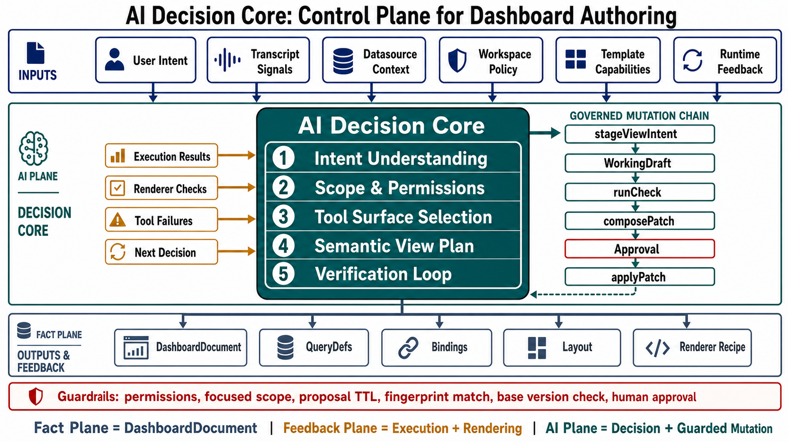
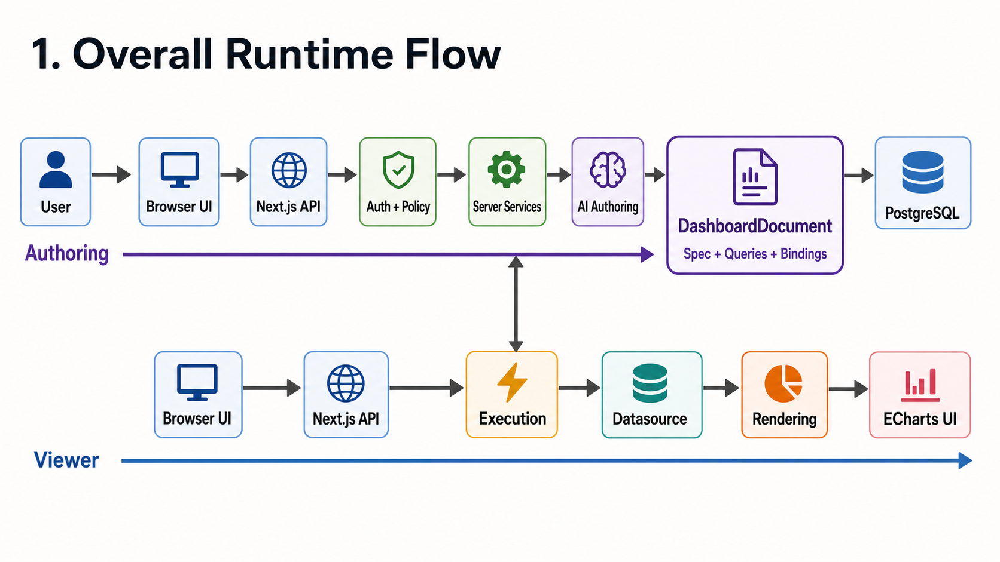
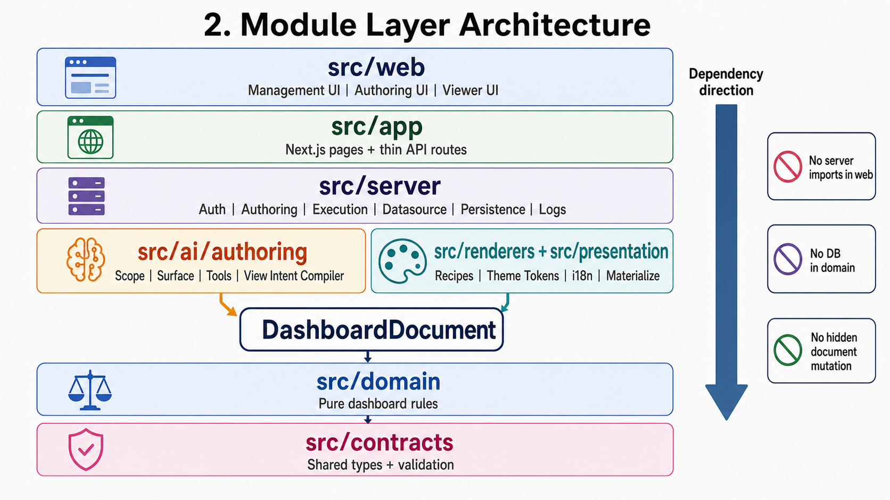
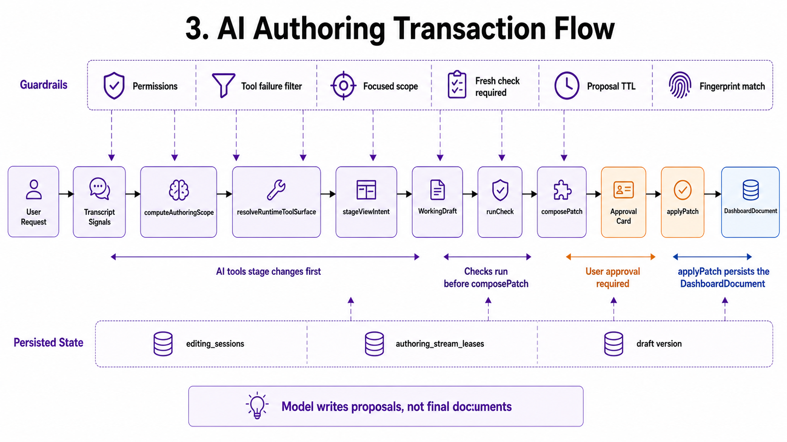
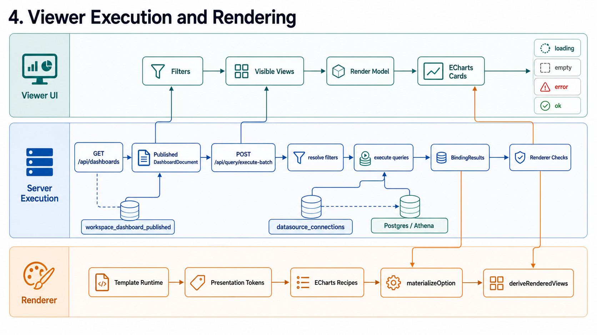
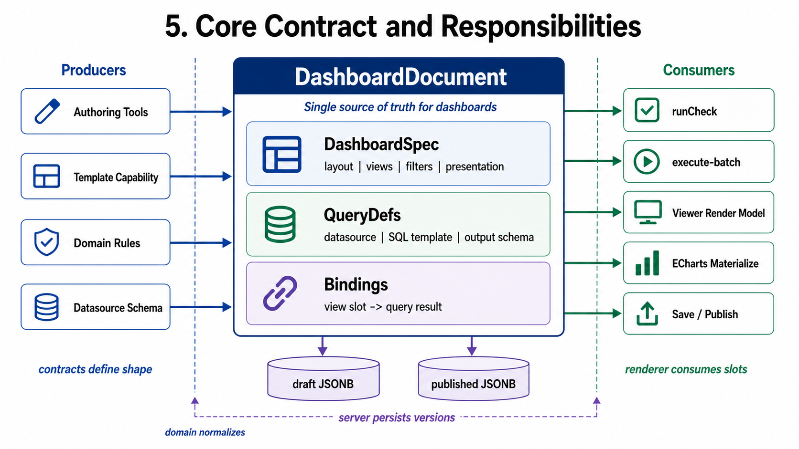

# Architecture Visuals

These diagrams are presentation-ready visual summaries of the system design.
For the source-grounded text version, see `docs/system-architecture-overview.md`.

## 1. AI Decision Core Control Plane

## 2. Overall Runtime Flow

## 3. Module Layer Architecture

## 4. AI Authoring Transaction Flow

## 5. Viewer Execution and Rendering

## 6. Core Contract and Responsibilities

