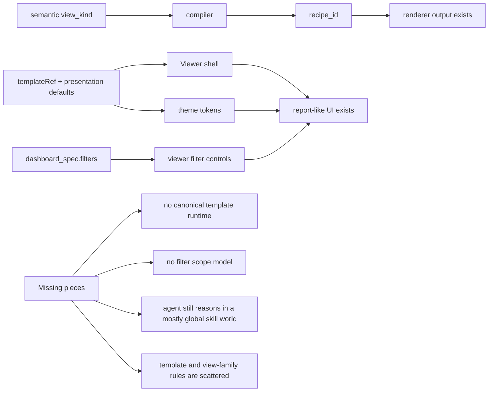
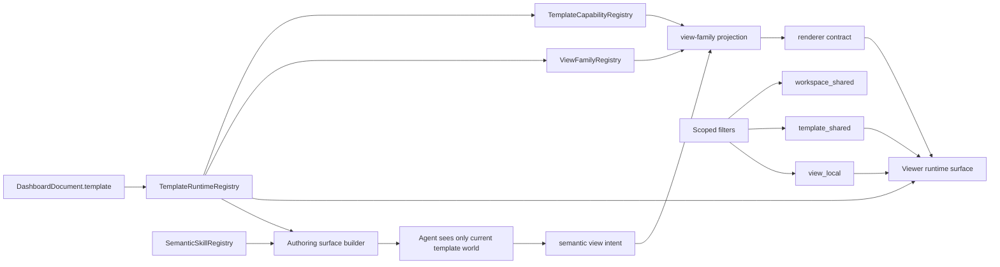
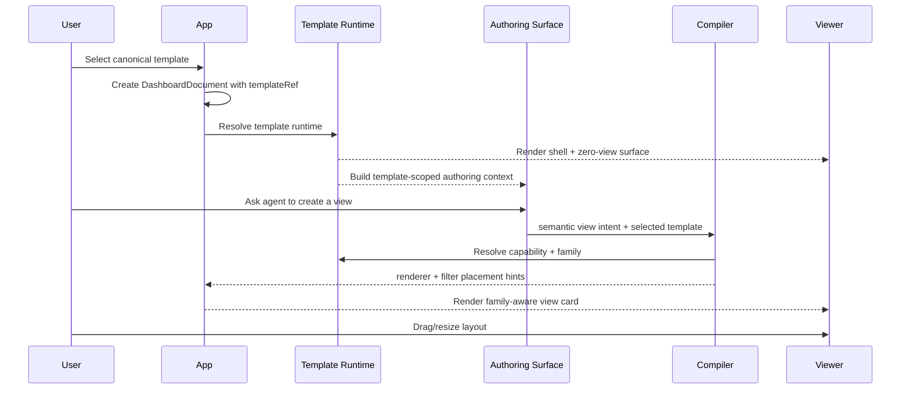

# Template Runtime Architecture Implementation Plan

> **For agentic workers:** REQUIRED SUB-SKILL: Use superpowers:subagent-driven-development (recommended) or superpowers:executing-plans to implement this plan task-by-task. Steps use checkbox (`- [ ]`) syntax for tracking.

**Goal:** Build an extensible dashboard template runtime where the selected template owns shell, shared filter presentation, zero-view behavior, and view-family projection, while agent-generated views stay semantic and layout remains user-controlled.

**Architecture:** Consolidate the current scattered template/theme/shell/compiler logic into a single runtime registry under `src/presentation/dashboard/runtime/`, then make AI authoring and viewer rendering consume that registry instead of encoding template behavior in several unrelated places. Persist filter scopes in `DashboardDocument`, keep semantic `view_intent` as the source of business intent, and project `view_kind -> view family -> renderer` inside the selected template world only.

**Tech Stack:** TypeScript, Next.js 15 App Router, React 19, ECharts 5, Node test runner (`node --test --experimental-strip-types`), existing dashboard contracts/validation layer.

---

## Reference Diagrams

### Current architecture



### Target architecture



### V1 workflow



## File Structure

### New files

- `src/presentation/dashboard/runtime/template-runtime-registry.ts`
  Canonical runtime definitions for the merged first template, including shell, zero-view, control band, and default theme/style.

- `src/presentation/dashboard/runtime/template-capability-registry.ts`
  Declares which semantic view kinds are supported by each template and which view family each kind projects to.

- `src/presentation/dashboard/runtime/view-family-registry.ts`
  Defines family-level chrome/style rules such as KPI/trend/signal/analysis card behavior.

- `src/presentation/dashboard/runtime/index.ts`
  Stable export surface for the runtime registry layer.

- `src/ai/authoring/template-runtime/authoring-surface.ts`
  Builds template-scoped visible skills, prompt fragments, and template-only authoring guidance.

- `src/ai/authoring/template-runtime/view-family-projection.ts`
  Resolves `view_kind -> view family -> internal recipe` for the selected template.

- `src/web/viewer/template-runtime/filter-placement.ts`
  Groups filters by scope and target for control-band rendering and view-local rendering.

- `src/web/viewer/ui/view-local-filter-controls.tsx`
  Renders `view_local` filters inside a single card without duplicating shared filter controls.

### Modified files

- `src/contracts/dashboard.ts`
  Add scoped filter fields and canonical template identifiers.

- `src/contracts/validation.ts`
  Validate scoped filters, targets, canonical template id, and merged runtime constraints.

- `src/presentation/dashboard/templates.ts`
  Repoint template summaries and template resolution to the new runtime registry.

- `src/domain/dashboard/templates.ts`
  Reuse the same canonical runtime source instead of maintaining a second template definition.

- `src/presentation/dashboard/themes.ts`
  Resolve themes and default style ids from the canonical runtime definition.

- `src/presentation/dashboard/presentation-context.ts`
  Resolve runtime, capabilities, view family, and theme together.

- `src/contracts/dashboard-view-policy.ts`
  Delegate `view_kind` mapping to the capability registry.

- `src/contracts/dashboard-recipe-policy.ts`
  Delegate allowed/internal recipe visibility to the runtime capability registry.

- `src/ai/authoring/view-intent/compiler.ts`
  Replace direct design-kit mapping with template runtime projection.

- `src/ai/authoring/tools/registry-builder.ts`
  Build a template-scoped tool/skill exposure surface.

- `src/ai/authoring/tools/shared-tools.ts`
  Remove hardcoded operational template defaults and consume runtime/capability helpers.

- `src/web/viewer/ui/viewer-dashboard.tsx`
  Always enter runtime shell mode for the canonical template, even at zero views.

- `src/web/viewer/ui/viewer-dashboard-chrome.tsx`
  Render only `template_shared` filters in the control band and remove the assumption that all filters are shared.

- `src/web/viewer/ui/viewer-filter-controls.tsx`
  Accept explicit filter lists instead of iterating the entire dashboard filter array blindly.

- `src/web/viewer/state/viewer-state.ts`
  Build default filter values by scope and support target-aware local filters.

- `src/web/dashboard/render-input.ts`
  Include only renderable filter scopes in preview/batch payloads.

- `src/server/execution/execute-batch.ts`
  Validate scope-aware filter usage and keep execution semantics compatible with the flat `filter_values` payload.

- `src/web/authoring/ui/template-picker-page.tsx`
  Show the merged canonical template as the first formal template, not the old blank-report concept.

- `tests/dashboard-template.test.ts`
  Primary contract coverage for runtime registry, scoped filters, merged canonical template, and zero-view behavior.

- `tests/authoring-reliability.test.ts`
  Cover template-scoped authoring surface and family projection.

- `tests/render-input-and-approval.test.ts`
  Cover runtime/capability filtering and ensure stageViewIntent still accepts only semantic inputs.

- `tests/dashboard-render-model.test.ts`
  Cover zero-view shell, scoped filter placement, and family-aware viewer behavior.

## Task 1: Create the canonical template runtime registry

**Files:**
- Create: `src/presentation/dashboard/runtime/template-runtime-registry.ts`
- Create: `src/presentation/dashboard/runtime/index.ts`
- Modify: `src/presentation/dashboard/templates.ts`
- Modify: `src/domain/dashboard/templates.ts`
- Modify: `src/presentation/dashboard/index.ts`
- Test: `tests/dashboard-template.test.ts`

- [ ] **Step 1: Write the failing registry tests**

```ts
test("canonical template runtime exposes one merged first template", () => {
  const runtime = resolveTemplateRuntime();
  assert.equal(runtime.id, "report_runtime_v1");
  assert.equal(runtime.metadata.badgeKey, "authoring.templates.defaultReport.badge");
  assert.equal(runtime.zeroView.mode, "full_shell");
});

test("template summaries come from the canonical runtime registry", () => {
  const summaries = listDashboardTemplateSummaries();
  assert.deepEqual(
    summaries.map((summary) => summary.id),
    ["report_runtime_v1"],
  );
  assert.equal(summaries[0]?.cardCount, 0);
});
```

- [ ] **Step 2: Run the focused test and verify the old template model fails**

Run: `node --test --experimental-strip-types tests/dashboard-template.test.ts`

Expected: FAIL with missing `resolveTemplateRuntime` export and/or the summary still exposing the legacy merged template ids.

- [ ] **Step 3: Create the canonical runtime registry**

```ts
// src/presentation/dashboard/runtime/template-runtime-registry.ts
export interface TemplateRuntimeDefinition {
  id: "report_runtime_v1";
  version: "1";
  metadata: {
    nameKey: string;
    descriptionKey: string;
    badgeKey: string;
    featureKeys: string[];
  };
  zeroView: {
    mode: "full_shell";
    showControlBand: true;
  };
  shell: {
    surface: "report";
    defaultColorThemeId: "purple" | "teal";
    defaultViewStyleId: "emphasis" | "clean" | "gradient";
  };
}

const CANONICAL_TEMPLATE_RUNTIME: TemplateRuntimeDefinition = {
  id: "report_runtime_v1",
  version: "1",
  metadata: {
    nameKey: "authoring.templates.defaultReport.name",
    descriptionKey: "authoring.templates.defaultReport.description",
    badgeKey: "authoring.templates.defaultReport.badge",
    featureKeys: [
      "authoring.templates.features.emptyCanvas",
      "authoring.templates.features.aiFirst",
      "authoring.templates.features.cleanReport",
    ],
  },
  zeroView: {
    mode: "full_shell",
    showControlBand: true,
  },
  shell: {
    surface: "report",
    defaultColorThemeId: "purple",
    defaultViewStyleId: "emphasis",
  },
};

export function resolveTemplateRuntime() {
  return structuredClone(CANONICAL_TEMPLATE_RUNTIME);
}

export function listTemplateRuntimes() {
  return [resolveTemplateRuntime()];
}
```

- [ ] **Step 4: Repoint existing template helpers to the runtime registry**

```ts
// src/presentation/dashboard/templates.ts
import { resolveTemplateRuntime, listTemplateRuntimes } from "@/presentation/dashboard/runtime";

export function listDashboardTemplateSummaries(): DashboardTemplateSummary[] {
  return listTemplateRuntimes().map((runtime) => ({
    id: runtime.id,
    version: runtime.version,
    ref: { id: runtime.id, version: runtime.version },
    nameKey: runtime.metadata.nameKey,
    descriptionKey: runtime.metadata.descriptionKey,
    badgeKey: runtime.metadata.badgeKey,
    featureKeys: [...runtime.metadata.featureKeys],
    accent: "purple",
    cardCount: 0,
    filterCount: 0,
  }));
}
```

```ts
// src/domain/dashboard/templates.ts
import { resolveTemplateRuntime } from "@/presentation/dashboard/runtime";

const runtime = resolveTemplateRuntime();
const DEFAULT_REPORT_TEMPLATE = {
  id: runtime.id,
  version: runtime.version,
  // keep dashboardDefaults/layout/starter here only as document bootstrap data
};
```

- [ ] **Step 5: Re-run the focused template tests**

Run: `node --test --experimental-strip-types tests/dashboard-template.test.ts`

Expected: PASS for the new runtime registry assertions and existing template summary coverage.

- [ ] **Step 6: Commit**

```bash
git add \
  src/presentation/dashboard/runtime/template-runtime-registry.ts \
  src/presentation/dashboard/runtime/index.ts \
  src/presentation/dashboard/templates.ts \
  src/domain/dashboard/templates.ts \
  src/presentation/dashboard/index.ts \
  tests/dashboard-template.test.ts
git commit -m "feat: add canonical template runtime registry"
```

## Task 2: Add scoped filter contracts to DashboardDocument

**Files:**
- Modify: `src/contracts/dashboard.ts`
- Modify: `src/contracts/validation.ts`
- Modify: `src/presentation/dashboard/templates.ts`
- Test: `tests/dashboard-template.test.ts`

- [ ] **Step 1: Write failing tests for filter scopes and ownership**

```ts
test("dashboard filters support template_shared and view_local scopes", () => {
  const document = createDashboardFromTemplate();
  document.dashboard_spec.filters = [
    {
      id: "f_channel",
      kind: "single_select",
      label: "Channel",
      scope: "template_shared",
      affected_view_ids: ["v_revenue", "v_orders"],
      options: [{ label: "All channels", value: "all" }],
      default_value: "all",
    },
    {
      id: "f_region_local",
      kind: "single_select",
      label: "Region",
      scope: "view_local",
      owner_view_id: "v_orders",
      options: [{ label: "North", value: "north" }],
      default_value: "north",
    },
  ];

  const validation = validateDashboardDocument(document, "save");
  assert.equal(validation.ok, true, validation.ok ? undefined : JSON.stringify(validation.issues));
});

test("view_local filters must define owner_view_id", () => {
  const document = createDashboardFromTemplate();
  document.dashboard_spec.filters = [{
    id: "f_bad",
    kind: "single_select",
    label: "Broken",
    scope: "view_local",
    options: [{ label: "All", value: "all" }],
  }] as never;

  const validation = validateDashboardDocument(document, "save");
  assert.equal(validation.ok, false);
  assert.match(JSON.stringify(validation.issues), /owner_view_id/);
});
```

- [ ] **Step 2: Run the focused test and verify the current flat filter model fails**

Run: `node --test --experimental-strip-types tests/dashboard-template.test.ts`

Expected: FAIL because `scope`, `affected_view_ids`, and `owner_view_id` are not recognized by the contract/validation layer.

- [ ] **Step 3: Extend the persisted filter contract**

```ts
// src/contracts/dashboard.ts
export type DashboardFilterScope =
  | "workspace_shared"
  | "template_shared"
  | "view_local";

export interface BaseDashboardFilter {
  id: string;
  kind: "time_range" | "single_select";
  label: string;
  scope: DashboardFilterScope;
  default_value?: string;
  options?: FilterOption[];
  resolved_fields?: string[];
  affected_view_ids?: string[];
  owner_view_id?: string;
}
```

- [ ] **Step 4: Add scope-aware validation rules**

```ts
// src/contracts/validation.ts
if (!FILTER_SCOPES.has(String(filter.scope))) {
  pushIssue(issues, `${path}.scope`, "filter scope must be workspace_shared, template_shared, or view_local");
}

if (filter.scope === "template_shared" && !isStringArray(filter.affected_view_ids)) {
  pushIssue(issues, `${path}.affected_view_ids`, "template_shared filters must declare affected_view_ids");
}

if (filter.scope === "view_local" && !isNonEmptyString(filter.owner_view_id)) {
  pushIssue(issues, `${path}.owner_view_id`, "view_local filters must declare owner_view_id");
}
```

- [ ] **Step 5: Keep the bootstrap document empty but scope-ready**

```ts
// src/presentation/dashboard/templates.ts
const DEFAULT_FILTERS: DashboardFilter[] = [];

starter: {
  views: [],
  desktopItems: [],
  mobileItems: [],
},
filters: DEFAULT_FILTERS,
```

- [ ] **Step 6: Re-run the contract tests**

Run: `node --test --experimental-strip-types tests/dashboard-template.test.ts`

Expected: PASS for valid scope combinations; FAIL only for the intentional invalid owner-view case.

- [ ] **Step 7: Commit**

```bash
git add \
  src/contracts/dashboard.ts \
  src/contracts/validation.ts \
  src/presentation/dashboard/templates.ts \
  tests/dashboard-template.test.ts
git commit -m "feat: add scoped dashboard filters"
```

## Task 3: Introduce template capabilities and view families

**Files:**
- Create: `src/presentation/dashboard/runtime/template-capability-registry.ts`
- Create: `src/presentation/dashboard/runtime/view-family-registry.ts`
- Modify: `src/contracts/dashboard-view-policy.ts`
- Modify: `src/contracts/dashboard-recipe-policy.ts`
- Modify: `src/presentation/dashboard/presentation-context.ts`
- Test: `tests/dashboard-template.test.ts`

- [ ] **Step 1: Write failing tests for family projection**

```ts
test("canonical template maps semantic kinds into view families", () => {
  const mapping = getDesignKitViewKindMapping({
    designKitId: "report_runtime_v1",
    viewKind: "time_trend",
    viewStyleId: "emphasis",
  });

  assert.deepEqual(mapping, {
    recipeId: "echarts-line",
    bodyContract: "shell_chrome_forbidden",
    viewFamilyId: "trend",
  });
});
```

- [ ] **Step 2: Run the focused test and verify the current mapping lacks family metadata**

Run: `node --test --experimental-strip-types tests/dashboard-template.test.ts`

Expected: FAIL because `viewFamilyId` is missing and the template id is still design-kit specific.

- [ ] **Step 3: Create the capability and family registries**

```ts
// src/presentation/dashboard/runtime/view-family-registry.ts
export type ViewFamilyId = "kpi" | "trend" | "signal" | "analysis";

export interface ViewFamilyDefinition {
  id: ViewFamilyId;
  cardChrome: "kpi" | "chart" | "signal";
  localFilterPlacement: "inline" | "toolbar";
}

export const VIEW_FAMILIES: Record<ViewFamilyId, ViewFamilyDefinition> = {
  kpi: { id: "kpi", cardChrome: "kpi", localFilterPlacement: "inline" },
  trend: { id: "trend", cardChrome: "chart", localFilterPlacement: "toolbar" },
  signal: { id: "signal", cardChrome: "signal", localFilterPlacement: "inline" },
  analysis: { id: "analysis", cardChrome: "chart", localFilterPlacement: "toolbar" },
};
```

```ts
// src/presentation/dashboard/runtime/template-capability-registry.ts
export interface TemplateViewKindCapability {
  recipeId: EChartsStageChartRecipeId;
  bodyContract: "shell_chrome_forbidden";
  viewFamilyId: ViewFamilyId;
}

export const TEMPLATE_CAPABILITIES = {
  report_runtime_v1: {
    stat_kpi: { recipeId: "echarts-kpi-card", bodyContract: "shell_chrome_forbidden", viewFamilyId: "kpi" },
    time_trend: { recipeId: "echarts-line", bodyContract: "shell_chrome_forbidden", viewFamilyId: "trend" },
    category_comparison: { recipeId: "echarts-bar", bodyContract: "shell_chrome_forbidden", viewFamilyId: "analysis" },
    ranked_bar: { recipeId: "echarts-ranked-bar", bodyContract: "shell_chrome_forbidden", viewFamilyId: "analysis" },
    signal_list: { recipeId: "echarts-signal-list", bodyContract: "shell_chrome_forbidden", viewFamilyId: "signal" },
    funnel: { recipeId: "echarts-funnel", bodyContract: "shell_chrome_forbidden", viewFamilyId: "analysis" },
    bounded_gauge: { recipeId: "echarts-kpi-gauge", bodyContract: "shell_chrome_forbidden", viewFamilyId: "kpi" },
  },
} as const;
```

- [ ] **Step 4: Delegate the current policy helpers to the new registries**

```ts
// src/contracts/dashboard-view-policy.ts
import { getTemplateCapability } from "@/presentation/dashboard/runtime";

export function getDesignKitViewKindMapping(input: {
  designKitId: string;
  viewKind: DashboardViewKind;
  viewStyleId: string;
}) {
  return getTemplateCapability(input.designKitId, input.viewKind);
}
```

```ts
// src/contracts/dashboard-recipe-policy.ts
export function getDesignKitSupportedViewKinds(designKitId: string) {
  return listTemplateSupportedViewKinds(designKitId);
}
```

- [ ] **Step 5: Expose the resolved family through presentation context**

```ts
// src/presentation/dashboard/presentation-context.ts
const capability = view?.view_intent
  ? getTemplateCapability(designKit.id, view.view_intent.view_kind)
  : null;

return {
  // existing fields...
  viewFamily: capability ? resolveViewFamily(capability.viewFamilyId) : null,
};
```

- [ ] **Step 6: Re-run contract tests**

Run: `node --test --experimental-strip-types tests/dashboard-template.test.ts`

Expected: PASS for family projection assertions and existing recipe-policy coverage.

- [ ] **Step 7: Commit**

```bash
git add \
  src/presentation/dashboard/runtime/template-capability-registry.ts \
  src/presentation/dashboard/runtime/view-family-registry.ts \
  src/contracts/dashboard-view-policy.ts \
  src/contracts/dashboard-recipe-policy.ts \
  src/presentation/dashboard/presentation-context.ts \
  tests/dashboard-template.test.ts
git commit -m "feat: add template capabilities and view families"
```

## Task 4: Scope the authoring surface to the selected template

**Files:**
- Create: `src/ai/authoring/template-runtime/authoring-surface.ts`
- Modify: `src/ai/authoring/tools/registry-builder.ts`
- Modify: `src/ai/authoring/tools/shared-tools.ts`
- Modify: `src/ai/authoring/view-intent/compiler.ts`
- Test: `tests/authoring-reliability.test.ts`
- Test: `tests/render-input-and-approval.test.ts`

- [ ] **Step 1: Write failing tests for template-scoped skill visibility**

```ts
test("authoring surface only exposes semantic skills supported by the selected template", () => {
  const skillIds = availableSemanticSkillIdsForTemplate({
    templateId: "report_runtime_v1",
    runtimeSkillCatalog: new Map([
      ["stat-kpi", { skill_id: "stat-kpi" } as never],
      ["time-trend", { skill_id: "time-trend" } as never],
    ]),
  });

  assert.deepEqual(skillIds, ["stat-kpi", "time-trend"]);
});

test("loadSkill rejects renderer-internal recipes even inside the canonical template", async () => {
  await assert.rejects(
    () => executeTool(loadSkillTool, { name: "echarts-kpi-card" }),
    /internal and cannot be loaded by the agent/i,
  );
});
```

- [ ] **Step 2: Run the authoring tests and verify visibility is still global**

Run: `node --test --experimental-strip-types tests/authoring-reliability.test.ts tests/render-input-and-approval.test.ts`

Expected: FAIL because skill exposure still uses the global skill catalog and does not consult the selected template runtime.

- [ ] **Step 3: Create template-scoped authoring helpers**

```ts
// src/ai/authoring/template-runtime/authoring-surface.ts
export function availableSemanticSkillIdsForTemplate(input: {
  templateId: string;
  runtimeSkillCatalog: Map<string, AuthoringSkillSummary>;
}) {
  const supportedKinds = listTemplateSupportedViewKinds(input.templateId);
  const supportedSkillIds = supportedKinds.map((viewKind) => getSemanticSkillIdForViewKind(viewKind));
  return supportedSkillIds.filter((skillId) => input.runtimeSkillCatalog.has(skillId));
}

export function buildTemplateScopedPromptSummary(templateId: string) {
  const runtime = resolveTemplateRuntime(templateId);
  return {
    templateId: runtime.id,
    zeroViewMode: runtime.zeroView.mode,
    supportedViewKinds: listTemplateSupportedViewKinds(templateId),
  };
}
```

- [ ] **Step 4: Rewire tool/skill exposure through the helper**

```ts
// src/ai/authoring/tools/registry-builder.ts
const selectedTemplateId =
  runtime.dashboard.dashboard_spec.template?.id ?? "report_runtime_v1";

const semanticSkillIds = availableSemanticSkillIdsForTemplate({
  templateId: selectedTemplateId,
  runtimeSkillCatalog: runtime.skillCatalog,
});
```

```ts
// src/ai/authoring/tools/shared-tools.ts
const PREVIEW_TABLE_RECIPE_ID = getDesignKitViewKindMapping({
  designKitId: "report_runtime_v1",
  viewKind: "ranked_bar",
  viewStyleId: "emphasis",
})?.recipeId;
```

- [ ] **Step 5: Make the compiler consume template-scoped family projection**

```ts
// src/ai/authoring/view-intent/compiler.ts
const projection = resolveTemplateViewProjection({
  templateId: presentation.designKit.id,
  viewKind: input.intent.view_kind,
});

const builder = getInternalStageChartBuilder(projection.recipeId);
```

- [ ] **Step 6: Re-run authoring tests**

Run: `node --test --experimental-strip-types tests/authoring-reliability.test.ts tests/render-input-and-approval.test.ts`

Expected: PASS for template-scoped visibility and stageViewIntent regression coverage.

- [ ] **Step 7: Commit**

```bash
git add \
  src/ai/authoring/template-runtime/authoring-surface.ts \
  src/ai/authoring/tools/registry-builder.ts \
  src/ai/authoring/tools/shared-tools.ts \
  src/ai/authoring/view-intent/compiler.ts \
  tests/authoring-reliability.test.ts \
  tests/render-input-and-approval.test.ts
git commit -m "feat: scope authoring surface to selected template"
```

## Task 5: Render zero-view shell, shared control-band filters, and view-local filters

**Files:**
- Create: `src/web/viewer/template-runtime/filter-placement.ts`
- Create: `src/web/viewer/ui/view-local-filter-controls.tsx`
- Modify: `src/web/viewer/ui/viewer-filter-controls.tsx`
- Modify: `src/web/viewer/ui/viewer-dashboard-chrome.tsx`
- Modify: `src/web/viewer/ui/viewer-dashboard.tsx`
- Modify: `src/web/viewer/state/viewer-state.ts`
- Modify: `src/web/viewer/ui/viewer.module.css`
- Test: `tests/dashboard-render-model.test.ts`

- [ ] **Step 1: Write failing viewer tests for zero-view shell and scoped filter placement**

```ts
test("canonical template still renders shell chrome at zero views", () => {
  const document = makeDocument();
  document.dashboard_spec.views = [];
  document.dashboard_spec.layout.desktop!.items = [];

  const model = buildDashboardRenderModel({
    dashboard: document,
    mode: "preview",
    viewMode: "desktop",
    bindingResults: {},
    requestState: "ready",
  });

  assert.equal(model.visibleViews.length, 0);
  assert.equal(model.template.resolvedId, "report_runtime_v1");
});

test("viewer filter grouping separates template_shared and view_local filters", () => {
  const dashboard = makeDocument();
  dashboard.dashboard_spec.filters = [
    { id: "f_shared", kind: "single_select", label: "Channel", scope: "template_shared", affected_view_ids: ["v_orders"], options: [{ label: "All", value: "all" }], default_value: "all" },
    { id: "f_local", kind: "single_select", label: "Region", scope: "view_local", owner_view_id: "v_orders", options: [{ label: "North", value: "north" }], default_value: "north" },
  ] as never;

  const groups = groupFiltersForViewer(dashboard);
  assert.deepEqual(groups.templateShared.map((filter) => filter.id), ["f_shared"]);
  assert.deepEqual(groups.viewLocalByViewId.get("v_orders")?.map((filter) => filter.id), ["f_local"]);
});
```

- [ ] **Step 2: Run the viewer tests and verify everything is still treated as a single shared filter list**

Run: `node --test --experimental-strip-types tests/dashboard-render-model.test.ts`

Expected: FAIL because zero-view shell assumptions and scope-aware grouping do not exist yet.

- [ ] **Step 3: Create filter grouping helpers**

```ts
// src/web/viewer/template-runtime/filter-placement.ts
export function groupFiltersForViewer(dashboard: DashboardDocument) {
  const templateShared = dashboard.dashboard_spec.filters.filter(
    (filter) => filter.scope === "template_shared",
  );
  const viewLocalByViewId = new Map<string, DashboardFilter[]>();

  for (const filter of dashboard.dashboard_spec.filters) {
    if (filter.scope !== "view_local" || !filter.owner_view_id) continue;
    const current = viewLocalByViewId.get(filter.owner_view_id) ?? [];
    current.push(filter);
    viewLocalByViewId.set(filter.owner_view_id, current);
  }

  return { templateShared, viewLocalByViewId };
}
```

- [ ] **Step 4: Render only shared filters in the control band and local filters inside each card**

```tsx
// src/web/viewer/ui/viewer-dashboard-chrome.tsx
const { templateShared } = groupFiltersForViewer(dashboard);

<ViewerFilterControls
  filters={templateShared}
  filterValues={selectedFilterValues}
  compact
  onChange={onFilterValuesChange}
  t={t}
/>
```

```tsx
// src/web/viewer/ui/view-local-filter-controls.tsx
export function ViewLocalFilterControls(props: {
  filters: DashboardFilter[];
  filterValues: Record<string, JsonValue>;
  onChange: (nextValues: Record<string, JsonValue>) => void;
  t: TranslateFn;
}) {
  return (
    <ViewerFilterControls
      filters={props.filters}
      filterValues={props.filterValues}
      compact
      onChange={props.onChange}
      t={props.t}
    />
  );
}
```

- [ ] **Step 5: Keep the shell visible at zero views**

```tsx
// src/web/viewer/ui/viewer-dashboard.tsx
const showDashboardFallback =
  !layoutResolution.layout ||
  (effectiveRequestState === "ready" && visibleViews.length === 0 && !isReportSurface);

const showReportControls = isReportSurface;
const showZeroViewCanvas = isReportSurface && visibleViews.length === 0;
```

```css
/* src/web/viewer/ui/viewer.module.css */
.zeroViewCanvas {
  min-height: 240px;
  border: 1px dashed var(--dashboard-theme-card-border);
  border-radius: var(--dashboard-theme-card-radius, 8px);
  background: color-mix(in srgb, var(--dashboard-theme-card) 92%, white);
}
```

- [ ] **Step 6: Re-run the viewer tests**

Run: `node --test --experimental-strip-types tests/dashboard-render-model.test.ts`

Expected: PASS for zero-view shell and filter grouping coverage.

- [ ] **Step 7: Commit**

```bash
git add \
  src/web/viewer/template-runtime/filter-placement.ts \
  src/web/viewer/ui/view-local-filter-controls.tsx \
  src/web/viewer/ui/viewer-filter-controls.tsx \
  src/web/viewer/ui/viewer-dashboard-chrome.tsx \
  src/web/viewer/ui/viewer-dashboard.tsx \
  src/web/viewer/state/viewer-state.ts \
  src/web/viewer/ui/viewer.module.css \
  tests/dashboard-render-model.test.ts
git commit -m "feat: render scoped filters in viewer runtime"
```

## Task 6: Keep preview and execution plumbing compatible with scoped filters

**Files:**
- Modify: `src/web/dashboard/render-input.ts`
- Modify: `src/server/execution/execute-batch.ts`
- Modify: `src/server/execution/preview-engine.ts`
- Test: `tests/dashboard-template.test.ts`
- Test: `tests/dashboard-render-model.test.ts`

- [ ] **Step 1: Write failing tests for scope-aware request building**

```ts
test("preview request includes selected values for template_shared and view_local filters", () => {
  const dashboard = makeDocument();
  dashboard.dashboard_spec.filters = [
    { id: "f_shared", kind: "single_select", label: "Channel", scope: "template_shared", affected_view_ids: ["v_orders"], options: [{ label: "All", value: "all" }], default_value: "all" },
    { id: "f_local", kind: "single_select", label: "Region", scope: "view_local", owner_view_id: "v_orders", options: [{ label: "North", value: "north" }], default_value: "north" },
  ] as never;

  const request = buildDashboardPreviewRequest({
    dashboard,
    visibleViewIds: ["v_orders"],
    selectedFilterValues: { f_shared: "all", f_local: "north" },
  });

  assert.deepEqual(request.filter_values, { f_shared: "all", f_local: "north" });
});
```

- [ ] **Step 2: Run the focused tests and verify old builder assumptions**

Run: `node --test --experimental-strip-types tests/dashboard-template.test.ts tests/dashboard-render-model.test.ts`

Expected: FAIL because the request builders and validation still reason about a flat, unscoped shared filter list.

- [ ] **Step 3: Restrict request builders to renderable scopes**

```ts
// src/web/dashboard/render-input.ts
export function buildDashboardFilterValues(
  dashboard: DashboardDocument,
  options?: { selectedFilterValues?: Record<string, JsonValue> },
) {
  const renderableFilters = dashboard.dashboard_spec.filters.filter(
    (filter) => filter.scope !== "workspace_shared",
  );

  return Object.fromEntries(
    renderableFilters.flatMap((filter) => {
      const selectedValue = options?.selectedFilterValues?.[filter.id];
      if (selectedValue !== undefined) return [[filter.id, selectedValue] as const];
      if (filter.default_value !== undefined) return [[filter.id, filter.default_value] as const];
      return [];
    }),
  );
}
```

- [ ] **Step 4: Keep server-side validation aligned**

```ts
// src/server/execution/execute-batch.ts
const filterIds = new Set(
  input.document.dashboard_spec.filters
    .filter((filter) => filter.scope !== "workspace_shared")
    .map((filter) => filter.id),
);

input.document.dashboard_spec.filters
  .filter((filter) => filter.scope !== "workspace_shared")
  .forEach((filter) => {
    if (filter.default_value === undefined && input.filterValues?.[filter.id] === undefined) {
      issues.push({
        path: `filter_values.${filter.id}`,
        message: "filter_values must provide a value when the renderable filter has no default_value",
      });
    }
  });
```

- [ ] **Step 5: Re-run focused request/execution tests**

Run: `node --test --experimental-strip-types tests/dashboard-template.test.ts tests/dashboard-render-model.test.ts`

Expected: PASS with no regressions in preview request building.

- [ ] **Step 6: Commit**

```bash
git add \
  src/web/dashboard/render-input.ts \
  src/server/execution/execute-batch.ts \
  src/server/execution/preview-engine.ts \
  tests/dashboard-template.test.ts \
  tests/dashboard-render-model.test.ts
git commit -m "feat: keep scoped filters compatible with preview execution"
```

## Task 7: Finish the canonical template UX and remove legacy split assumptions

**Files:**
- Modify: `src/presentation/dashboard/themes.ts`
- Modify: `src/web/authoring/ui/template-picker-page.tsx`
- Modify: `src/web/authoring/ui/template-preview.tsx`
- Modify: `tests/dashboard-template.test.ts`
- Modify: `tests/authoring-reliability.test.ts`
- Modify: `tests/render-input-and-approval.test.ts`

- [ ] **Step 1: Write failing tests for the merged canonical template identity**

```ts
test("theme resolution uses the canonical merged template runtime id", () => {
  const theme = resolveDashboardTheme("purple", "report_runtime_v1");
  assert.equal(theme.designKitId, "report_runtime_v1");
});

test("template picker exposes the canonical merged template as the recommended first template", () => {
  const summaries = listDashboardTemplateSummaries();
  assert.equal(summaries[0]?.id, "report_runtime_v1");
});
```

- [ ] **Step 2: Run the broad template/authoring regression suite**

Run: `node --test --experimental-strip-types tests/dashboard-template.test.ts tests/authoring-reliability.test.ts tests/render-input-and-approval.test.ts`

Expected: FAIL because old design-kit ids and split assumptions are still referenced in themes, picker, and tests.

- [ ] **Step 3: Collapse theme resolution onto the canonical id**

```ts
// src/presentation/dashboard/themes.ts
export function resolveDashboardDesignKit(
  designKitId?: string | null,
): DashboardDesignKit {
  const normalized = designKitId?.trim() || "report_runtime_v1";
  if (normalized !== "report_runtime_v1") {
    throw new Error(`Unknown dashboard design kit: ${normalized}`);
  }
  return clone(CANONICAL_RUNTIME_DESIGN_KIT);
}
```

- [ ] **Step 4: Make the picker and preview speak in canonical-template terms**

```tsx
// src/web/authoring/ui/template-picker-page.tsx
const templates = useMemo(() => listDashboardTemplateSummaries(), []);
// remove legacy assumptions that the first template is a blank shell concept
```

```tsx
// src/web/authoring/ui/template-preview.tsx
<ChartFrame
  option={option}
  rowsCount={rowsCount}
  metaText="Canonical template preview uses the current runtime shell and family tokens."
/>;
```

- [ ] **Step 5: Re-run the broad regression suite plus typecheck**

Run: `node --test --experimental-strip-types tests/dashboard-template.test.ts tests/authoring-reliability.test.ts tests/render-input-and-approval.test.ts`

Expected: PASS

Run: `npm run typecheck`

Expected: PASS with no unresolved legacy template identifiers.

- [ ] **Step 6: Commit**

```bash
git add \
  src/presentation/dashboard/themes.ts \
  src/web/authoring/ui/template-picker-page.tsx \
  src/web/authoring/ui/template-preview.tsx \
  tests/dashboard-template.test.ts \
  tests/authoring-reliability.test.ts \
  tests/render-input-and-approval.test.ts
git commit -m "refactor: merge legacy template identities into canonical runtime"
```

## Task 8: Final verification and docs sanity pass

**Files:**
- Modify: `docs/architecture.md`
- Modify: `README.md`
- Test: `tests/dashboard-template.test.ts`
- Test: `tests/authoring-reliability.test.ts`
- Test: `tests/dashboard-render-model.test.ts`
- Test: `tests/render-input-and-approval.test.ts`

- [ ] **Step 1: Add architecture notes for template runtime and filter scopes**

```md
## Template Runtime

The selected dashboard template now resolves through a canonical template runtime registry.
Templates own shell, zero-view behavior, shared filter presentation, and view-family projection.
Semantic view intents remain global; the authoring surface is scoped to the selected template.

## Filter Scopes

- `workspace_shared`: reserved for future multi-dashboard surfaces
- `template_shared`: rendered in the template control band
- `view_local`: rendered inside an individual view
```

- [ ] **Step 2: Run the focused regression suite**

Run: `node --test --experimental-strip-types tests/dashboard-template.test.ts tests/authoring-reliability.test.ts tests/dashboard-render-model.test.ts tests/render-input-and-approval.test.ts`

Expected: PASS

- [ ] **Step 3: Run static verification**

Run: `npm run typecheck`

Expected: PASS

Run: `npm run lint`

Expected: PASS

- [ ] **Step 4: Commit**

```bash
git add \
  docs/architecture.md \
  README.md \
  tests/dashboard-template.test.ts \
  tests/authoring-reliability.test.ts \
  tests/dashboard-render-model.test.ts \
  tests/render-input-and-approval.test.ts
git commit -m "docs: describe canonical template runtime architecture"
```

## Self-Review Checklist

- Spec coverage:
  - Canonical template runtime: Task 1
  - Scoped filters: Tasks 2, 5, 6
  - Skill/template/family projection: Tasks 3, 4
  - Viewer zero-view and control band behavior: Task 5
  - Canonical merged template identity: Task 7
  - System docs and verification: Task 8

- Placeholder scan:
  - No `TBD`
  - No `TODO`
  - No "similar to Task N"
  - Every code-changing step includes code

- Type consistency:
  - Canonical template id: `report_runtime_v1`
  - Filter scopes: `workspace_shared`, `template_shared`, `view_local`
  - View families: `kpi`, `trend`, `signal`, `analysis`

