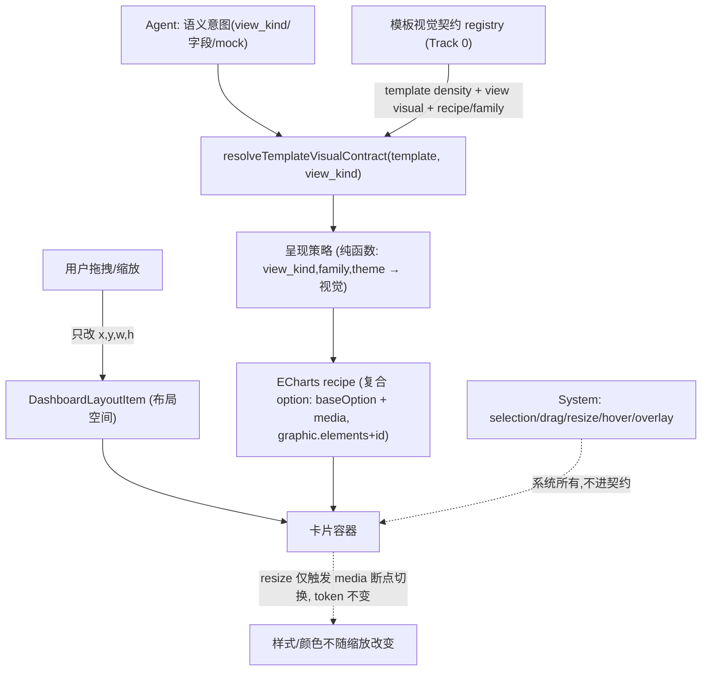

# Template View Visualization Contract — KPI First Cut

> 注:文件名沿用历史,内容已升级为**模板视觉契约**计划。KPI(`stat_kpi`/`bounded_gauge`)是契约的**第一批落地对象**,不是全部目标。

> **For agentic workers:** Use superpowers:executing-plans to implement this plan task-by-task. Steps use checkbox (`- [ ]`) syntax for tracking. Do **not** widen scope beyond the locked decisions below.

**Goal:** 把"模板拥有的视觉语言"从散落的 CSS/recipe **落成一套可扩展的数据契约**:`template → density` 解析文档级密度,`template + view_kind → recipe + view family + view 视觉契约` 解析单 view 的 chrome/body 语言;authoring preview / viewer runtime / server 校验**走同一条路径**。**新增模板 = 新增一套契约数据,新增 `view_kind` = 补一行标准视觉契约**,agent 与 viewer 均无感知。**KPI 是第一批落地对象**,其可见目标是贴近 `design-mockups/dashboard-template-control-band-mock.html`:(1) 相邻 KPI 读作一排整齐指标带;(2) 画布颗粒度更细;(3) KPI body 随卡片缩放按离散断点自适应、样式/颜色不随尺寸改变。

**核心原则(已与产品确认)—— 三方责任,互不重叠(canonical 设计陈述):**

- **Agent** 只产出单个 view 的语义意图(`view_kind` / 标题 / 字段 / mock 值);**从不组合、从不排版**(`src/ai/authoring/AGENTS.md`、`stage-view-intent` 工具仅收语义)。
- **Template = 设计语言**,拥有全部视觉,分两个尺度:**文档级**(密度 `gap` / `row_height` token)+ **view 级**(recipe body + chrome)。必须是 `(view_kind, family, theme)` 的纯函数、**与尺寸无关**。换模板即换一整套样式语言,agent 无感知。
- **User** 拥有每个 view 的 `(x,y,w,h)`;**排列是用户的、是涌现的**(系统**无 band/grouping 原语**)。
- **System(渲染壳/交互层)** 拥有 selection outline、drag/resize handles、编辑 overlay、hover/transient 交互态;**模板不得**触碰这些,**系统也不得**改 title/status/accent/padding/body 构图。这是两层渲染契约的**硬边界**——现 viewer 把二者混在同一 CSS 区(模板视觉属性 `data-view-card-chrome/-body-style`(`src/web/viewer/ui/viewer-dashboard.tsx:479-481`)与 `.card:hover`/resize 光标(`viewer.module.css:895-912`)同处),Track 0 要把它们分离。

由该划分**强制推出**四条自洽推论(满足即内部一致):

1. 用户拥有尺寸 **+** 模板须保证一致外观 ⟹ **body 必须尺寸无关(响应式)**;故 Track A 是设计自洽的**必要条件**,非可选优化。
2. 无人负责组合 ⟹ **"指标带"不是数据原语,而是用户摆放出的涌现视觉**(系统不持久化"这几个属于一组",已接受)。
3. 模板的尺寸默认值只是**建议**,用户 override 为准(`buildLayoutItem`: `override ?? existing ?? default`,`src/ai/authoring/tools/stage-chart-resolve.ts:76,81,87`)——故"模板给 default size"不破坏"布局归用户"。
4. 密度(`gap` / `row_height`)是模板**文档级**属性 ⟹ **必然全局**,无法只缩 KPI;Track B 的全局副作用是设计的**正确表现,非 bug**。

**Tech Stack:** TypeScript, Next.js 15 App Router, React 19, ECharts 5, Node test runner (`node --test --experimental-strip-types`),既有 dashboard contracts/presentation/renderers 分层。

---

## Background / 现状根因

诊断结论:模板**骨架已对齐**(品牌页头、控制带、view family 驱动卡片 chrome 都已接线),视觉出入来自三个**正交**问题(A/B 是 KPI 可见症状,C 是底层架构缺口):

- **问题 A — body 不随尺寸自适应(违反推论 1)。** canonical KPI recipe 用**绝对像素** `graphic` 坐标(`src/renderers/echarts/recipes/base-stage-chart-recipes.ts:390-433`,`left:24/top:18/fontSize:38`);resize 时 hook 只调 `chart.resize()`(`src/renderers/echarts/browser/use-echarts-chart.ts:54-56`),**不重算 graphic 坐标**——这是 canonical KPI 不自适应的**主因**:卡片放大后数字仍 38px、钉在左上角,周围留白;缩小则裁切。**次因**:`mergeGraphic` 靠"第 2 个 text 必是主值/打头 rect 是 accent"的**位置约定**(`materialize-option.ts:306-342`)脆弱,其历史钉值逻辑(`:344-360`)与"模板拥有尺寸"相悖,应一并清理。**(更正:canonical KPI `graphic[1]` 字号实测保持 38、并未被钉成 30/34/36,见 `tests/dashboard-template.test.ts:1199`;30/34/36 属另一分支,之前文档把两者混了。)**
- **问题 B — 没有"连体指标带"原语。** 4 个 KPI 是 12 栏网格里 4 张**各自独立**的卡(`src/web/viewer/ui/viewer.module.css:807` `.card` 自带边框/阴影/accent),卡间还有网格 gap。颗粒度细化只能更挤,**变不出** mock 的"单容器 + 内部分隔 + 共享 accent"。
- **问题 C — 视觉契约散落、非模板拥有的数据(架构缺口,Track 0 修)。** `TemplateViewKindCapability` 只有 `recipeId/bodyContract/viewFamilyId`(`src/contracts/dashboard-template-capability-registry.ts:14-18`),**不含 view 级 chrome/body 视觉契约**,也没有模板级 density 契约落点;具体视觉值散在全局 CSS 且**按 family 而非 template 键控**,`template runtime` 仍 canonical-only(`src/presentation/dashboard/runtime/template-runtime-registry.ts:15`)。后果:第二个模板**无法**对同一 family 定义不同视觉而不 fork CSS——"换模板=换语言"目前只是原则、没有数据落点。

> 关键认知:横向放 4 个 `w:3` KPI 在 12 列里**本来就占满一行**,"没挨在一起"的根源是 **gap + 每卡独立 chrome**,不是列数不够。

---

## Locked Decisions / 设计裁决(实现边界,勿擅自扩张)

1. **字号自适应走离散 `media` 断点**(非连续缩放),以保持 ECharts "物化一次" 契约。
2. **排列归用户,模板只拥有"单 view 的样式语言"。** agent 逐个生成**独立** KPI,其**样式与模板一致且尺寸无关**;怎么排(成行/成列/混搭)由用户拖拽决定。**模板不拥有布局、不自动成行;放弃** mock 的"无缝连体"与"自动成排"。agent 默认追加布局(`x=0/y=nextY`,竖向堆叠)是**预期行为、非痛点**。
3. **颗粒度**:只调 `gap` 与 `row_height`(非破坏),**不改列数**(`layout.cols` 维持 12)。
4. **不新增 `renderer.kind`**,KPI/band 继续走 ECharts;不引入 composite/DOM 渲染器。

### Rejected alternatives / 已否决方案及理由

- **Composite metric_band view(单容器多 slot)** — 唯一能给"无缝连体"的方案,但与"独立 view 用户拖拼"冲突,已否决。
- **新增 DOM/组件渲染器** — 能让文本 body 天然响应式,但属契约扩张;当前只 KPI 两个 recipe 用 graphic 排文字,性价比不足,已否决。
- **列数 12→24** — 横向放 4 KPI 用不到;且 recipe 的 `w/h` 字面量按 12 列写死,改列数需成套迁移 + 影响存量文档,已否决。
- **模板 placement policy(按 family 自动把 KPI 排成一行)** — 与"排列归用户"(推论 2)直接冲突;agent 默认追加布局虽不自动成行,但这是**预期行为、非痛点**,已否决。

---

## Target State / 目标态



---

## Track 0 — 视觉契约 registry(架构地基,先行)

> 把"模板=设计语言"从原则落成**数据**的关键一步。**没有它,Track A/B 会退化成局部 KPI CSS 修补;有它,新增模板 = 新增一套契约数据**,agent 与 viewer 均无感知。Track 0 与 Track B 可并行,但 Track 0 的契约形状应先定。

### Contract Shape / 契约形状(必须先锁)

契约分两层,避免把全局密度误塞进单个 view capability:

```ts
interface TemplateVisualContract {
  density: TemplateDensityContract; // document-level: gap / row_height / rhythm
  views: Record<DashboardViewKind, TemplateViewKindCapability>;
}

interface TemplateViewKindCapability {
  recipeId: EChartsStageChartRecipeId;
  bodyContract: "shell_chrome_forbidden";
  viewFamilyId: ViewFamilyId;
  visual: TemplateViewKindVisualContract; // view-level only, no density
}
```

`TemplateViewKindVisualContract` 至少表达:card chrome(accent / border / shadow / padding)、header layout(title/status/filter placement)、body composition、preview display、responsive body policy、default size hint。`default size hint` 只是模板推荐尺寸来源,不拥有用户布局;用户改 `(x,y,w,h)` 后永远优先。

### Canonical View Kind Visual Matrix / 全 `view_kind` 视觉契约矩阵

| `view_kind` | recipe | family | chrome contract | body visual contract | responsive / size rule | default size hint |
|---|---|---|---|---|---|---|
| `stat_kpi` | `echarts-kpi-card` | `kpi` | metric chrome:`cardChrome=kpi`,`headerLayout=metric`,`status=inline`,`filters=inline`;紧凑 padding + 单卡 accent,不复制 shell title/status | `metric_value_text`:主值、辅助标签、delta/accent 均在 body 内;不得拥有外层卡片 chrome | body 用 `baseOption.graphic.elements + media` 离散断点;样式/颜色 token 不随尺寸变 | desktop `3x2`, mobile `4x2` |
| `bounded_gauge` | `echarts-kpi-gauge` | `kpi` | 同属 metric chrome,但 body composition 与 `stat_kpi` 独立;不得只靠 `[data-view-family="kpi"]` 粗暴覆盖 | `gauge_progress`:环/指针/进度/detail 为 body 内可视化 | gauge 半径、center、detail 字号由 recipe/media 或 ECharts 自适应策略控制;不改 shell chrome | desktop `4x4`, mobile `4x4` |
| `time_trend` | `echarts-line` | `trend` | chart chrome:`cardChrome=chart`,`headerLayout=section`,`status=topline`,`filters=toolbar` | `time_series_line`:时间轴、数值轴、tooltip、legend/series 可选 | grid/axis/legend 响应式;多 series 经 transform 生成,view shell 不参与 | desktop `8x6`, mobile `4x6` |
| `category_comparison` | `echarts-bar` | `analysis` | chart chrome:`cardChrome=chart`,`headerLayout=section`,`status=topline`,`filters=toolbar` | `vertical_category_bar`:类目轴 + 纵向柱,颜色来自模板 chart token | grid/axis label/bar width 响应式;不因卡片尺寸改变语义配色 | desktop `6x6`, mobile `4x6` |
| `ranked_bar` | `echarts-ranked-bar` | `analysis` | chart chrome,与 analysis 系列保持同一 header/status/filter 语言 | `horizontal_ranked_bar`:倒序类目、横向条、右侧数值 label/background track | right label 空间、barMaxWidth、axis label 由 recipe token/断点控制 | desktop `6x5`, mobile `4x5` |
| `signal_list` | `echarts-signal-list` | `signal` | signal chrome:`cardChrome=signal`,`headerLayout=compact`,`status=inline`,`filters=inline` | `signal_bar_list`:高密度信号列表,左侧标签 + 横条 + 右侧值 | dense label/right-value 留白由 recipe token/断点控制;适合窄卡 | desktop `4x6`, mobile `4x6` |
| `funnel` | `echarts-funnel` | `analysis` | chart chrome,与 analysis 系列保持同一 header/status/filter 语言 | `funnel_progress_steps`:阶段标签 + 百分比进度条/track | left label 与 right percent 空间由 recipe token/断点控制 | desktop `6x5`, mobile `4x5` |

**矩阵约束:** 以上 7 行是 canonical 模板的完整视觉契约。未来新增模板必须为这 7 个 `view_kind` 各自提供同构契约;未来新增 `view_kind` 必须先补矩阵行、recipe、family、body contract、响应式策略与测试覆盖,否则不得进入 agent 可生成集合。

- [x] **0.1 — 新增 `TemplateVisualContract` 并扩展 `TemplateViewKindCapability.visual`。** 在 `src/contracts/dashboard-template-capability-registry.ts:14-18` 现有 `recipeId/bodyContract/viewFamilyId` 上,新增模板拥有的**view 级视觉契约**(声明式纯数据):card chrome、header/status/filter placement、body composition、preview、responsive policy、default size hint。contracts 层只放形状不放逻辑(遵 `src/contracts/AGENTS.md`)。
- [x] **0.2 — 密度 token 收归 `TemplateVisualContract.density`。** 现密度散在 `src/presentation/dashboard/themes.ts:525-542`(canonical-only)。改为由模板契约提供文档级密度 token 集合,presentation 仅解析,不再硬编 canonical 值;**禁止**在每个 `view_kind` capability 内重复写 density。
- [x] **0.3 — 把上方矩阵落成 canonical 数据。** `stat_kpi/time_trend/category_comparison/ranked_bar/signal_list/funnel/bounded_gauge` 7 个 `view_kind` 必须全部有 `visual` 字段,且 `bodyComposition` 能区分同 family 下的不同 body(尤其 `stat_kpi` vs `bounded_gauge`)。
- [x] **0.4 — viewer 消费契约,而非硬编 family CSS。** `src/web/viewer/ui/viewer-dashboard.tsx:479-481` 现把 `data-view-card-chrome/-body-style` 喂给全局 CSS;改为让卡片视觉由契约 token 驱动(CSS 变量/内联),使第二个模板可对同一 family 定义不同视觉而**不 fork CSS**。
- [x] **0.5 — 钉死 template vs system 边界。** 模板契约只表达 title/status/accent/padding/body;系统交互态(selection/drag/resize/hover/overlay,`viewer.module.css:895-912`)**不进**契约,保持系统所有。
- [x] **0.6 — 统一解析路径。** authoring preview、viewer runtime、server 校验都经 `getTemplateCapability(...)` 或同层 helper(如 `resolveTemplateViewVisualContract(...)`)拿同一份视觉契约,禁止旁路 fixture(遵 `src/ai/authoring/AGENTS.md`)。

**Track 0 验收:** 给一个**假想第二模板**(仅测试夹具)填一套不同视觉契约,断言同一 `view_kind` 解析出不同 view 视觉,同一模板只解析出一份 document-level density,且 7 个 `view_kind` 都有完整 `visual` 字段;agent 语义输入、viewer 分支逻辑、recipe 均不变。

---

## Track B — 相邻 KPI 成排 + 更细颗粒度(非破坏,先做)

> ⚠️ **全局副作用提醒:** CSS grid 的 `gap` 与 `row_height` 是**整张网格统一**的,无法只缩 KPI。下列 B1/B2 会让**整份报表**更紧凑;这是已接受的代价(真正零间距连体需 composite,已否决)。建议值均为**初始推荐、可调**,落地后请肉眼校准。

- [x] **B1 — 调小报表网格 gap。** 改 `src/presentation/dashboard/themes.ts` 的 `densityTokens.gridGap`(当前:default `:540`=`"18px"`,compact `:532`=`"16px"`)。建议默认档 `18px → 12px`、compact 档 `16px → 10px`。该 token 经 `--dashboard-density-grid-gap` 喂给 `.gridReport`(`src/web/viewer/ui/viewer.module.css:790`)。**不要**直接改 `.grid`(`:786`)硬编值。
- [x] **B2 — 调小 row_height 下限/默认,给更细垂直颗粒度。** 改 `src/domain/dashboard/layout.ts`:`LAYOUT_ROW_HEIGHT_MIN`(`:7` 24 → 14);`effectiveLayoutRowHeight` 默认(`:22,24` 30 → 24)。模板默认行高在 `src/contracts/dashboard-templates.ts:80`(desktop)/`:84`(mobile)的 `row_height: 30 → 24`。**同步更新**断言 row_height 的测试(见 Test Plan)。
- [x] **B3 — KPI 卡 chrome 由 Track 0 视觉契约驱动。** 不再把"成排"观感写成 `.card[data-view-family="kpi"]` 的局部 CSS 例外;应把 `stat_kpi` 的 metric chrome token(accent/padding/border/shadow/header rhythm)落在 `TemplateViewKindCapability.visual` 中,viewer 只消费 token。**不得**做"检测相邻卡、消除内边框"的合并 hack(脆弱且属渲染评审 skill 明确警告项)。⚠️ **波及面:** `bounded_gauge` 也是 `viewFamilyId:"kpi"`(`src/contracts/dashboard-template-capability-registry.ts:52-55`),但它的 `bodyComposition=gauge_progress` 必须与 `stat_kpi` 区分;是否共享 chrome 由契约显式声明,不能靠 family 选择器隐式连带。

**Track B 验收:** 新建 canonical 模板报表 → 放 4 个 stat_kpi → 一行内读作紧凑成排指标带；其余图表密度可接受；resize 仍由用户自由控制。

---

## Track A — KPI body 离散 media 响应式(契约形状变更,后做)

> ⚠️ **这是 `option_template` 的形状改造,风险高于 Track B。** 建议 Track B 落地、肉眼确认成排效果后再开 A。

**背景约束(已核实):** ECharts media 必须用**"复合 option"** `{ baseOption, media: [{ query: { minWidth?/maxWidth? }, option }] }`;`baseOption` 必用,命中 query 时其 `option` 经 `mergeOption` 合入。而当前 `EChartsOptionTemplate = JsonObject`(开放对象,可承载 `media`),物化是**原地改扁平键**(`option.graphic/series/grid` 直接赋值,`materialize-option.ts`)。因此引入 media 必须让"扁平 option"升级为"复合 option",并让物化在 `baseOption` 上跑既有 merge、且解析 `media[].option` 内的 `$theme/$i18n`。

- [x] **A1 — canonical KPI recipe 改为复合 option。** 在 `src/renderers/echarts/recipes/base-stage-chart-recipes.ts:390-433`(`isCanonicalRuntimeTheme` 分支)输出 `{ baseOption: { graphic: { elements: [{ id, … }] } }, media: [{ query: { maxWidth }, option: { graphic: { elements: [{ id, … 字号覆盖 … }] } } }] }`。**必须用 `graphic.elements` 对象形 + 给每个元素稳定 `id`**:ECharts 会把裸数组 `graphic:[…]` 包装成 `{elements:[…]}` 并**按 `id` 合并**(`node_modules/echarts/lib/component/graphic/install.js:57-70`),无 `id` 则 media 合并不到、放大不恢复(本地 probe 已证)。`baseOption` 即 **default 档**,须显式给出基础字号,media 仅覆盖更窄断点。锚点尽量改相对(`left/top` 用 `%` + `textAlign:"center"`)使其填满卡片;字号按 2-3 档 `maxWidth` 断点切换(如 ≤220 / ≤320 / 默认)。slot 路径(`graphic[1].style.text`)需同步改为指向 `baseOption.graphic.elements[1]`。
- [x] **A2 — 物化支持复合 option + 松开硬钉字号。** 在 `src/renderers/echarts/browser/materialize-option.ts`:识别 `{baseOption, media}` 形状,对 `baseOption` 跑现有 `mergeGrid/mergeSeries/mergeGraphic`,并对每个 `media[].option` 解析 `$theme/$i18n`(颜色/标签)。**同步升级 `mergeGraphic` 支持两种 shape:** legacy `graphic: []` 与 ECharts 标准 `graphic: { elements: [] }`;对 `media[].option.graphic.elements` 也必须走同一 helper,不能只处理 root 裸数组。**移除/弱化** `mergeGraphic` 的硬钉字号(`:344-360`),改为只补 theme 颜色,把尺寸交给 recipe/media；同时用 slot 路径/显式标记替代"第 2 个 text 必是主值"的位置约定(`:306-342`),否则未来多元素 body 会错位。
- [x] **A3 — 校验跑通复合 option。** 确认 `src/renderers/echarts/server/validate-option.ts:182-188` 与 `src/renderers/echarts/browser/validate-option.ts:46-47` 的 `setOption(option, true)` 能接受复合 option(ECharts 原生支持;注意避免与 `replaceMerge` 混用,见 echarts#18588)。preview 物化路径(`src/renderers/echarts/preview/sample-option.ts`)同样需处理复合形状。**新增 contract helper 统一遍历 `root / baseOption / media[].option`**:现 `rendererBodyDuplicatesShellChrome` 只查 root `graphic/title/series`(`src/contracts/validation.ts:509-517`),KPI 一旦移入 `baseOption.graphic`,shell-chrome 重复保护会**漏判**,必须让该校验覆盖复合形状全部层级。
- [x] **A4 — 测试。** 更新/新增物化与校验测试(见 Test Plan):断言复合 option 被正确解析、`media` 断点存在、字号不再被物化硬钉、`$theme/$i18n` 在 baseOption 与 media 内均已解析完毕。

**Track A 验收:** 单个 KPI 卡从小拖到大,数字按断点切档放大、accent/留白比例协调；颜色/样式 token 全程不变；server/browser 校验通过且物化产物无 `$theme/$i18n` 残留。

---

## Risks & Caveats

- **全局密度(B1/B2):** 影响整份报表,非仅 KPI。务必肉眼校准，必要时回退到更保守的值。
- **契约形状(A1/A2):** 扁平 → 复合 option 会触及所有读取 `option_template` 的路径(materialize / preview / validate / 既有测试夹具)。务必全量搜索 `option_template`、`materializeEChartsOptionTemplate`、`getTemplatePreviewOption` 的调用点逐一核对。
- **位置约定脆弱性(A2):** 现有物化靠 graphic 元素顺序识别主值；改动时若保留顺序假设,后续任何 body 元素增减都会回归。建议借此改为 slot 路径驱动。
- **Track 0 是架构落地、非小补丁:** 扩展契约形状 + 让 viewer 消费契约会触及 contracts/presentation/web 三层。它是"换模板=换语言"的**前提**;但**不要求**本计划真的实现第二个模板——可扩展性由契约形状 + 假想夹具验证即可,勿借此扩张到多模板交付。
- **非破坏优先:** Track 0、A、B 都不改 `layout.cols`、不新增 `renderer.kind`、不引入 composite；如发现必须突破,请回到产品裁决,勿在本计划内擅自扩张。

---

## Test Plan

- 主测试文件:`tests/dashboard-template.test.ts`(含 recipe↔builder 完整性、物化、模板默认值、KPI body chrome 校验如 `:1741`)。
- B2 会动 row_height,需检查断言 `row_height`/clamp 的用例(如 `tests/dashboard-template.test.ts:1719-1728`、`tests/render-input-and-approval.test.ts:114-117`)。
- A2/A3 需新增:复合 option 物化往返、`media` 断点保留(`graphic.elements` 带 `id`)、`mergeGraphic` 同时支持 `graphic: []` 与 `graphic: { elements: [] }`、字号不被硬钉、shell-chrome 校验遍历 `baseOption/media[].option`、server 校验通过(参考既有 `materialized report ECharts option validates on the server` 用例)。
- **Track 0 — view_kind 覆盖矩阵(必加):** 对 registry 全部 7 个 `view_kind`(`stat_kpi/time_trend/category_comparison/ranked_bar/signal_list/funnel/bounded_gauge`)逐一断言:`getTemplateCapability(template, view_kind)` 解析出**完整 view 级视觉契约**(recipe + family + chrome/body/responsive/default size hint),且模板只解析出一份**文档级 density**;authoring preview / viewer runtime / server 校验取的是**同一份**契约,不存在旁路或 per-view density 复制。
- **不要新建测试文件**,在既有套件内扩充用例。

### Verification commands

```bash
node --test --experimental-strip-types tests/dashboard-template.test.ts
node --test --experimental-strip-types tests/render-input-and-approval.test.ts tests/authoring-reliability.test.ts
npm run typecheck && npm run typecheck:tests
npm test
```

视觉核验(非自动化):本地启动后对照 `design-mockups/dashboard-template-control-band-mock.html`,确认 (1) 4 个 KPI 成排紧凑;(2) 单卡 resize 字号按断点切档、颜色不变。

---

## Touchpoint Index(实现时按此逐一核对)

| 关注点 | 文件:行 |
|---|---|
| canonical KPI recipe(graphic 绝对坐标) | `src/renderers/echarts/recipes/base-stage-chart-recipes.ts:390-433` |
| 物化硬钉字号 + 位置约定 | `src/renderers/echarts/browser/materialize-option.ts:296-369` |
| resize 仅 `resize()` 不重算 | `src/renderers/echarts/browser/use-echarts-chart.ts:54-56,106-111` |
| 密度 gap token | `src/presentation/dashboard/themes.ts:532,540,594` |
| 报表网格消费 gap token | `src/web/viewer/ui/viewer.module.css:790` |
| row_height clamp/默认 | `src/domain/dashboard/layout.ts:7-8,21-25` |
| 模板默认 row_height | `src/contracts/dashboard-templates.ts:80,84` |
| KPI 卡 chrome / body | `src/web/viewer/ui/viewer.module.css:807,902,908,1134` |
| card grid span(用户尺寸来源) | `src/web/viewer/state/viewer-state.ts:196,201-206` |
| server / browser 校验 | `src/renderers/echarts/server/validate-option.ts:182-188`、`src/renderers/echarts/browser/validate-option.ts:46-47` |
| shell-chrome 重复保护(只查 root,需遍历复合) | `src/contracts/validation.ts:509-517` |
| agent 默认布局(`x=0/y=nextY` 追加) | `src/ai/authoring/tools/stage-chart-resolve.ts:61-97` |
| view family → recipe 映射(gauge 也归 kpi) | `src/contracts/dashboard-template-capability-registry.ts:20-58` |
| 视觉契约形状(待扩展 view visual + template density) | `src/contracts/dashboard-template-capability-registry.ts:14-18` |
| 统一解析入口 `getTemplateCapability` | `src/contracts/dashboard-template-capability-registry.ts:114-123` |
| template runtime(canonical-only,待泛化) | `src/presentation/dashboard/runtime/template-runtime-registry.ts:15-52,101-117` |
| viewer 卡片视觉属性(待改契约驱动) | `src/web/viewer/ui/viewer-dashboard.tsx:479-481` |
| 系统交互态(不进契约) | `src/web/viewer/ui/viewer.module.css:895-912` |
| ECharts graphic 数组→elements 包装 | `node_modules/echarts/lib/component/graphic/install.js:57-70` |
