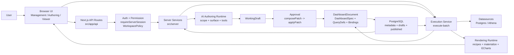
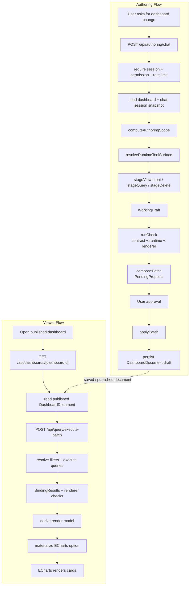
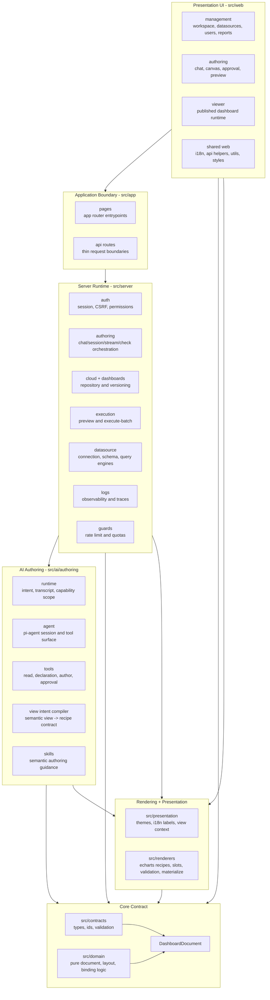

# System Architecture Overview

This is the short architecture map for AI Dashboard Studio. It is meant to be
read before `docs/architecture.md`.

## 1. Overall Flow

The system is reasonable mainly because it has one central product contract:
`DashboardDocument = DashboardSpec + QueryDefs + Bindings`. Authoring, checks,
execution, save/publish, and viewer rendering all converge on that contract.



### Main Runtime Loops



## 2. Module Architecture



## 3. Module Responsibilities

| Module | Owns | Should not own | Key paths |
| --- | --- | --- | --- |
| `src/contracts` | Shared data shapes, ids, request/response contracts, validation | Business behavior, persistence, UI logic | `src/contracts/dashboard.ts`, `src/contracts/validation.ts` |
| `src/domain` | Pure dashboard behavior: document normalization, layout, bindings, fingerprints | React, fetch, DB, renderer-specific option mutation | `src/domain/dashboard/document.ts`, `src/domain/dashboard/layout.ts` |
| `src/presentation` | Display policy shared across UI and renderer: themes, i18n refs, presentation context | React components, DB access, renderer validation | `src/presentation/dashboard/presentation-context.ts`, `src/presentation/dashboard/themes.ts` |
| `src/renderers` | ECharts recipes, slot materialization, renderer validation, option templates | Dashboard shell chrome, server repositories, authoring UI | `src/renderers/echarts/recipes`, `src/renderers/echarts/browser/materialize-option.ts` |
| `src/web/management` | Workspace management UI: reports, datasources, users, settings | Server-only logic | `src/web/management` |
| `src/web/authoring` | Authoring workspace UI: chat, canvas, approval card, preview state | Direct DB access, AI tool policy | `src/web/authoring` |
| `src/web/viewer` | Published dashboard runtime UI and filter interactions | Authoring-only draft behavior | `src/web/viewer` |
| `src/app` | Next.js pages and thin route handlers | Business logic that belongs in `src/server` | `src/app/page.tsx`, `src/app/api/**` |
| `src/server/auth` | Session, CSRF, permission checks, workspace policy | Frontend state or UI routing | `src/server/auth` |
| `src/server/authoring` | Chat request lifecycle, session snapshots, stream leases, approval preflight | Agent semantic policy internals | `src/server/authoring` |
| `src/ai/authoring/runtime` | Intent detection, transcript inspection, capability scope | Persistence and route transport | `src/ai/authoring/runtime` |
| `src/ai/authoring/agent` | Pi-agent session, tool surface selection, hooks, ledger | Dashboard repository writes outside tools | `src/ai/authoring/agent` |
| `src/ai/authoring/tools` | Formal mutation/read surface: read tools, `stageViewIntent`, `stageQuery`, `runCheck`, `composePatch`, `applyPatch` | Hidden direct mutation paths | `src/ai/authoring/tools` |
| `src/server/execution` | Preview and execute-batch, filter resolution, query-to-binding result mapping | Chart shell presentation | `src/server/execution` |
| `src/server/datasource` | Datasource connection storage, schema discovery, query engines | Dashboard document ownership | `src/server/datasource` |
| `src/server/cloud` / `src/server/dashboards` | Dashboard draft/published persistence, migrations, versioning | Renderer option generation | `src/server/cloud`, `src/server/dashboards` |
| `src/server/logs` | Observability events, trace/log sinks | Request control flow decisions | `src/server/logs` |
| `src/server/guards` | Rate limits, quotas, capacity gates | Feature-specific behavior | `src/server/guards` |

## 4. Reasonableness Assessment

The architecture is broadly sound.

- The strongest decision is the single `DashboardDocument` contract. It prevents
  the authoring state, execution state, and viewer state from becoming separate
  products.
- The second strong decision is the explicit authoring tool surface. Mutations go
  through staged tools, `runCheck`, `composePatch`, approval, and `applyPatch`
  instead of letting the model write arbitrary document JSON.
- The layer split is mostly clean: routes are thin, server orchestration is under
  `src/server`, pure document rules are under `src/domain`, and renderer behavior
  is isolated under `src/renderers`.
- The template/runtime policy is in the right place: semantic view kinds are
  mapped to renderer recipes through template capability contracts, not through
  ad hoc UI decisions.

The main design risk is keeping the authoring tool surface disciplined as new
view kinds are added. The current boundary is:

- `stageViewIntent`: agent-facing semantic authoring surface.
- `stageQuery`: guarded correction lane for existing query SQL.
- `stageDelete`: pure removal transaction.
- internal compiled chart transaction primitives: implementation detail used by
  runtime compilation, not the public model-facing creation API.

## 5. Recommended Simplification

Keep the long architecture document as the full source, but use this short map
as the onboarding entrypoint. The top-level story should consistently say:

```text
natural language -> semantic view intent -> template capability -> renderer recipe
-> WorkingDraft -> checks -> approval -> DashboardDocument -> execution/rendering
```
